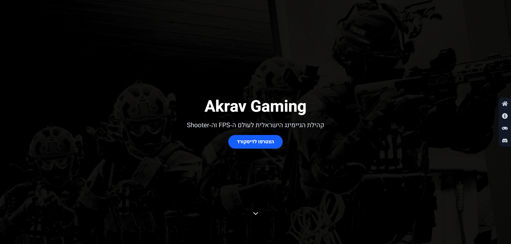

# 🎯 Akrav Gaming

An Israeli FPS & Shooter gaming community website built with **React** and **Tailwind CSS**.  
Modern dark-themed design with glowing effects, smooth scrolling, and Discord integration.



## 🌍 Live Demo
[🔗 Visit Akrav Gaming](http://akrav-gaming.netlify.app)

## 🚀 Features
- 🎮 **Game Communities** showcase (Battlefield, CS2, Rust, Ready or Not, COD Warzone, PUBG)
- 💬 **Discord Integration** for quick joining
- 🌑 **Modern Dark UI** with glowing accents
- 🖱 **Smooth Scroll Navigation** between sections
- 📱 Fully responsive design

## 🛠 Tech Stack
- **React** (Vite)
- **Tailwind CSS**
- **React Icons**
- **Smooth Scroll / Scroll Spy**

## 📦 Installation
```bash
# Clone the repository
git clone https://github.com/your-username/akrav-gaming.git

# Navigate to the project
cd akrav-gaming

# Install dependencies
npm install

# Run development server
npm run dev
```

---

© 2025 **Akrav Gaming** – Built by [Ben Katalan](https://benkatalan.netlify.app/)
